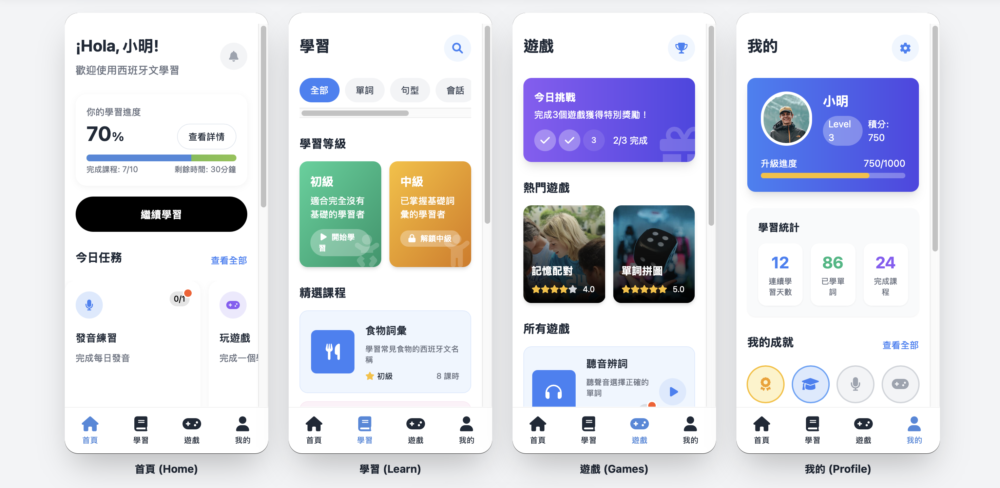

# 兒童西班牙文學習應用

這是一個專為兒童設計的西班牙文學習應用原型，使用 HTML 和 Tailwind CSS 構建。
目的在於測試 Cursor 的能力。

👉 [點我查看互動原型網站（GitHub Pages）](https://xilsxwu.github.io/test)

## 功能特色

- **互動式學習**：透過遊戲化方式學習西班牙文
- **詞彙學習**：包含各種主題的詞彙卡片
- **發音練習**：幫助兒童掌握正確發音
- **成就系統**：激勵兒童持續學習
- **家長監控**：讓家長能夠查看孩子的學習情況

## 頁面說明

- **index.html**: 主入口頁面，模擬 iPhone 15 外觀並通過 iframe 嵌入其他頁面
- **pages/home.html**: 首頁，展示學習進度和推薦內容
- **pages/learn.html**: 學習頁面，展示不同類型的學習內容和課程
- **pages/games.html**: 遊戲頁面，提供各種學習遊戲
- **pages/me.html**: 個人中心，顯示個人資料和學習統計
- **pages/vocabulary.html**: 詞彙學習頁面，展示單詞學習卡片

## 使用方法

1. 使用瀏覽器打開 `index.html` 文件
2. 通過底部導航欄切換不同頁面
3. 點擊各頁面中的按鈕和卡片進行交互

## 技術說明

- 使用 HTML5 構建頁面結構
- 使用 Tailwind CSS 進行樣式設計
- 使用 Font Awesome 提供圖標
- 使用 iframe 實現頁面嵌套和切換

## 設計理念

本應用的設計專注於兒童用戶體驗，採用了：

- 明亮、活潑的配色方案
- 大字體和明確的視覺提示
- 圓角元素增加友好感
- 豐富的插圖和動畫元素
- 簡單明了的導航結構

## 轉換為 Figma

這些 HTML 原型可以作為基礎轉換為 Figma 設計文件，進行進一步的視覺設計調整和迭代。各頁面已經考慮了原型到設計稿的轉換需求。 
